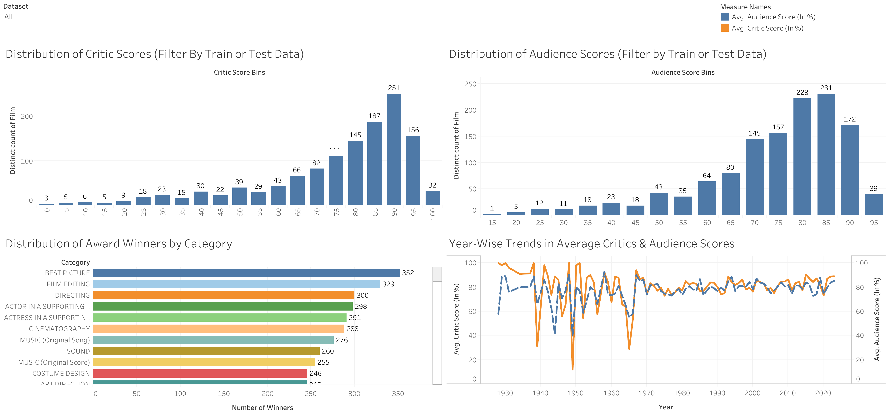
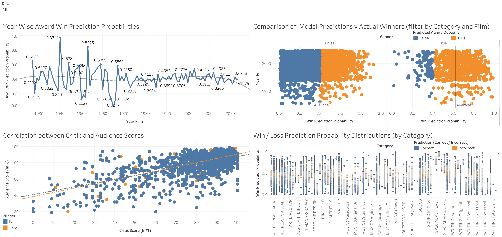
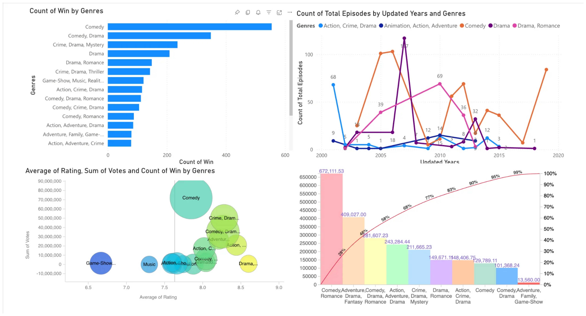

# 🎬 Red Carpet Analytics: Oscar & Emmy Award Prediction

> **Machine Learning + Business Intelligence Analysis of Award-Winning Entertainment**

[](https://python.org)
[](https://xgboost.readthedocs.io/)
[](https://public.tableau.com/app/profile/harshvardhan.sekar/viz/CanDataPredicttheOscarsATableauVisualizationofXGBoostInsights)
[](https://powerbi.microsoft.com/)
[](LICENSE)

---

## 📋 Table of Contents

- [Project Overview](#-project-overview)
- [Key Results](#-key-results)
- [Data Pipeline](#-data-pipeline)
- [Oscar Prediction (Segment 1)](#-segment-1-oscar-award-prediction)
- [Emmy Analysis (Segment 2)](#-segment-2-emmy-award-tv-shows-analysis)
- [Project Structure](#-project-structure)
- [Installation & Usage](#-installation--usage)
- [Data Sources](#-data-sources)
- [Team](#-team)

---

## 🎯 Project Overview

This project combines **Machine Learning** and **Business Intelligence** to analyze award-winning entertainment content across two segments:

| Segment | Focus | Tools | Outcome |
|---------|-------|-------|---------|
| **Segment 1** | Oscar Award Prediction | XGBoost, Random Forest, Tableau | ~80% accuracy in predicting winners |
| **Segment 2** | Emmy Award TV Shows Analysis | Power BI, Tableau Prep | Descriptive insights on winning patterns |

### Business Problem

The entertainment industry seeks to understand what factors contribute to critical success. This project addresses:
- **Which features significantly correlate with winning an Oscar?**
- **How do critic scores vs. audience scores influence award outcomes?**
- **What patterns exist in Emmy-winning TV shows across networks and genres?**

### Target Audience

- 🎥 **Film Studios & Producers** – Optimize production decisions for award success
- 📊 **Data Analysts & BI Practitioners** – ML/visualization applications in entertainment
- 🎓 **Academic Researchers** – Interdisciplinary predictive analytics in arts & media
- 📺 **Streaming Services** – Content strategy aligned with award-winning attributes

---

## 🏆 Key Results

### Oscar Prediction Model Performance

| Metric | Random Forest | XGBoost (Final) | Improvement |
|--------|---------------|-----------------|-------------|
| **Accuracy** | 79% | ~80% | +1% |
| **AUC-ROC** | 0.8028 | 0.7744 | - |
| **Recall (Winners)** | 21% | **80%** | **+280%** ✅ |
| **False Negative Rate** | High | **Significantly Reduced** | ✅ |

> **Key Improvement:** XGBoost with threshold tuning (0.4) and class balancing achieved **80% recall** for predicting actual winners—a critical improvement over Random Forest's 21% recall.

### Feature Importance

| Feature | Importance Score |
|---------|------------------|
| Category (Award Type) | 34.0% |
| Critic Score | 33.5% |
| Audience Score | 32.5% |

---

## 🔄 Data Pipeline

### Oscar Prediction Pipeline (Segment 1)

```
┌─────────────────────┐     ┌─────────────────────┐
│   movie_info.csv    │     │ the_oscar_award.csv │
│  (Rotten Tomatoes)  │     │   (Oscar History)   │
│   12,413 movies     │     │   10,889 records    │
└─────────┬───────────┘     └──────────┬──────────┘
          │                            │
          └──────────┬─────────────────┘
                     │
          ┌──────────▼──────────┐
          │  Tableau Prep ETL   │
          │  - Left Outer Join  │
          │  - Clean & Transform│
          │  - Remove nulls     │
          └──────────┬──────────┘
                     │
          ┌──────────▼──────────┐
          │  MasterData_Movies  │
          │    5,443 records    │
          └──────────┬──────────┘
                     │
          ┌──────────▼──────────┐
          │  Feature Engineering│
          │  + Unique_Group_ID  │
          │  + Category Encoding│
          └──────────┬──────────┘
                     │
     ┌───────────────┼───────────────┐
     │               │               │
┌────▼────┐    ┌─────▼─────┐   ┌─────▼─────┐
│ XGBoost │    │  Random   │   │  Tableau  │
│  Model  │    │  Forest   │   │  Visuals  │
└─────────┘    └───────────┘   └───────────┘
```

### Emmy Analysis Pipeline (Segment 2)

```
┌──────────────────┐  ┌──────────────────┐  ┌──────────────────┐
│ IMDb TV Shows    │  │ TV Shows Data.csv│  │The Emmy Awards.csv│
│   3,000 shows    │  │   2,565 shows    │  │  21,505 records  │
└────────┬─────────┘  └────────┬─────────┘  └────────┬─────────┘
         │                     │                     │
         └─────────────────────┼─────────────────────┘
                               │
                    ┌──────────▼──────────┐
                    │   Tableau Prep ETL  │
                    │  - Multi-way Join   │
                    │  - Genre One-Hot    │
                    │  - Aggregations     │
                    └──────────┬──────────┘
                               │
              ┌────────────────┼────────────────┐
              │                │                │
    ┌─────────▼─────────┐ ┌────▼────┐ ┌────────▼────────┐
    │ model_ready_file  │ │ Result  │ │   Power BI      │
    │   4,193 records   │ │  Data   │ │   Dashboard     │
    │ (26 genre cols)   │ │   73    │ │                 │
    └───────────────────┘ └─────────┘ └─────────────────┘
```

---

## 🎬 Segment 1: Oscar Award Prediction

### 🔗 [View Interactive Tableau Dashboard](https://public.tableau.com/app/profile/harshvardhan.sekar/viz/CanDataPredicttheOscarsATableauVisualizationofXGBoostInsights/CanDataPredicttheOscarsATableauVisualizationofXGBoostInsights)

### Machine Learning Models

#### XGBoost Classifier (Final Model)

```python
model = XGBClassifier(
    random_state=42,
    n_estimators=200,
    max_depth=5,
    learning_rate=0.1,
    scale_pos_weight=len(y_train[y_train == 0]) / len(y_train[y_train == 1])
)

# Threshold tuning for better recall
threshold = 0.4
y_pred = (y_proba >= threshold).astype(int)
```

**Key Techniques:**
- **Class Balancing**: `scale_pos_weight` to handle imbalanced data (winners << nominees)
- **Threshold Tuning**: Lowered decision threshold from 0.5 to 0.4 to reduce false negatives
- **Feature Scaling**: StandardScaler for consistent feature ranges

#### Model Comparison

| Aspect | Random Forest | XGBoost |
|--------|---------------|---------|
| **Precision (Winners)** | 85% | 39% |
| **Recall (Winners)** | 21% | **80%** |
| **F1-Score (Winners)** | 0.33 | 0.53 |
| **Business Value** | Misses most winners | Catches most winners ✅ |

> **Why XGBoost?** For this use case, **recall** matters more than precision. Missing an actual winner (false negative) is worse than incorrectly predicting a nominee will win. XGBoost's 80% recall means we correctly identify 4 out of 5 actual winners.

---

### Tableau Visualizations

#### Exploratory Data Analysis Dashboard



**Key Insights:**
- Critic scores cluster heavily between **70-95%**, with consistent distributions across training and testing sets
- Audience scores peak at **80-85%**, following a similar distribution pattern
- **Best Picture** leads with 352 winners, followed by Film Editing (329) and Directing (300)
- Year-wise trends show both critic and audience scores have generally increased over time

---

#### Model Performance Dashboard



**Key Insights:**
- Year-wise prediction probabilities fluctuate across decades, with peaks in years with critically dominant films (1939: 0.9741)
- The scatterplot clearly separates **predicted winners (orange)** from **non-winners (blue)**
- Strong **positive correlation** between critic and audience scores; winners cluster in the upper-right quadrant
- Win/Loss probability distributions vary significantly by category—technical categories show clearer patterns

---

#### Prediction Analysis Dashboard


**Key Insights:**
- **The Godfather**, **All the King's Men**, and **Hamlet** emerge with highest prediction probabilities
- Prediction accuracy varies by category—**Writing** and **Makeup** show strongest performance
- Acting and Directing categories show higher prediction errors due to their subjective nature
- Technical categories (Sound, Cinematography) have fewer prediction errors, suggesting clearer decision patterns

---

## 📺 Segment 2: Emmy Award TV Shows Analysis

### Data Sources

| Dataset | Records | Key Features |
|---------|---------|--------------|
| `IMDb TV Shows 1.csv` | 3,000 | Title, Duration, Genres, Rating, Votes |
| `TV Shows Data.csv` | 2,565 | Network, Seasons, Episodes, Runtime |
| `The Emmy Awards.csv` | 21,505 | Category, Nominee, Company, Win status |

### ETL Process

1. **Genre One-Hot Encoding**: Converted 26 genres into binary columns for ML readiness
2. **Data Merging**: Joined Emmy nominations with IMDb ratings and TV show metadata
3. **Output**: `model_ready_file.csv` (4,193 records) and `Result Data.csv` (73 aggregated records)

---

### Power BI Visualizations

#### Genre Analysis Dashboard



**Key Insights:**
- **Comedy** dominates Emmy wins with 600+ wins, followed by **Comedy-Drama** hybrids (~400 wins)
- Crime-Drama-Mystery and Drama categories show strong Emmy performance
- The Pareto chart shows **top 10 genres account for 99%** of Emmy wins
- Episode count by genre peaked around 2010-2015 for Comedy and Drama

---

#### Network Performance Dashboard


**Key Insights:**
- **ABC, HBO, NBC, CBS** lead Emmy wins (400+ each)
- Discovery Channel produces longest-running shows (16.42 avg seasons, 275 episodes)
- **AMC** has highest average rating (8.82) with 586K average votes
- HBO shows higher engagement but fewer seasons compared to broadcast networks
- Streaming platforms (Netflix, Amazon) produce shorter series with competitive ratings

---

## 📁 Project Structure

```
red-carpet-analytics/
│
├── 📄 README.md
├── 📄 LICENSE
├── 📄 requirements.txt
├── 📄 .gitignore
├── 📄 IS525 - Final Report DWBI.pdf
│
├── 📂 Phase 1 - Individual Datasets/
│   ├── movie_info.csv                    # Rotten Tomatoes (12,413 movies)
│   └── the_oscar_award.csv               # Oscar nominations (10,889 records)
│
├── 📂 Phase 2 - ETL using Tableau Builder/
│   ├── MasterData_Movies.csv             # ETL output (5,443 records)
│   ├── Masterdata_Movies.hyper           # Tableau Hyper extract
│   └── MasterData_Movies.tfl             # Tableau Prep flow file
│
├── 📂 Phase 3 - Updated Movie Analysis/
│   ├── Movie_Dataset_Predictive_Analytics_Random_Forest.ipynb
│   ├── Movie_Dataset_Predictive_Analytics_XGBoost.ipynb
│   └── updated_Movie_Masterdata.csv      # With Unique_Group_ID
│
├── 📂 Phase 4 - Final Train + Test Dashboards/
│   ├── DWBI Movies Project Visualizations XGBoost.twbx
│   └── final_movies_data.csv             # Predictions (5,442 records)
│
├── 📂 Project Part 2 - Analysis of TV Shows using PowerBI/
│   │
│   ├── 📂 Phase 1_ Individual CSVs/
│   │   ├── IMDb TV Shows 1.csv           # IMDb data (3,000 shows)
│   │   ├── TV Shows Data.csv             # Network info (2,565 shows)
│   │   └── The Emmy Awards.csv           # Emmy nominations (21,505 records)
│   │
│   ├── 📂 Phase 2_ ETL Results/
│   │   ├── Flow1.tfl                     # Tableau Prep flow
│   │   ├── model_ready_file.csv          # One-hot encoded genres
│   │   └── Result Data.csv               # Aggregated output
│   │
│   └── 📂 Power BI/
│       ├── PowerBI Visuals.pdf           # Dashboard exports
│       └── TV Shows Dashboard Final.pbix # Power BI dashboard
│
└── 📂 images/
    └── 📂 dashboards/                    # High-resolution dashboard images
        ├── 01_eda_dashboard.png
        ├── 02_model_performance.png
        ├── 03_prediction_analysis.png
        ├── 04_emmy_genre_analysis.png
        └── 05_emmy_network_analysis.png
```

---

## 🚀 Installation & Usage

### Prerequisites

```
Python 3.8+
Jupyter Notebook
Tableau Desktop/Public (for .twbx files)
Power BI Desktop (for .pbix files)
```

### Setup

```bash
# Clone the repository
git clone https://github.com/yourusername/red-carpet-analytics.git
cd red-carpet-analytics

# Create virtual environment
python -m venv venv
source venv/bin/activate  # On Windows: venv\Scripts\activate

# Install dependencies
pip install -r requirements.txt

# Run the notebook
cd "Phase 3 - Updated Movie Analysis"
jupyter notebook Movie_Dataset_Predictive_Analytics_XGBoost.ipynb
```

### Requirements

```
pandas>=1.3.0
numpy>=1.21.0
scikit-learn>=1.0.0
xgboost>=1.5.0
seaborn>=0.11.0
matplotlib>=3.4.0
joblib>=1.1.0
```

---

## 📚 Data Sources

| Dataset | Source | Records | Description |
|---------|--------|---------|-------------|
| Oscar Awards | [Kaggle](https://www.kaggle.com/datasets/unanimad/the-oscar-award) | 10,889 | Historical nominations (1928-2024) |
| Movie Ratings | [Rotten Tomatoes](https://www.rottentomatoes.com/) | 12,413 | Critic & audience scores |
| Emmy Awards | [Kaggle](https://www.kaggle.com/datasets/unanimad/emmy-awards) | 21,505 | Emmy nominations history |
| TV Shows | [IMDb](https://www.imdb.com/interfaces/) | 5,565 | TV show metadata & ratings |

---

## 👥 Team

- **Harshvardhan Sekar**
- **Ashwin Shanmugam**
- **Atharva Chaudhari**

**Course:** IS 525 - Data Warehousing and Business Intelligence  
**Institution:** University of Illinois Urbana-Champaign  
**Instructor:** Prof. Michael Wonderlich  
**Date:** December 2024

---

## 🙏 Acknowledgments

- **Prof. Michael Wonderlich** for guidance throughout the IS 525 course
- **Kaggle Community** for providing high-quality entertainment datasets

---

## 📄 License

This project is licensed under the MIT License - see the [LICENSE](LICENSE) file for details.

---

<p align="center">
  <b>🔗 <a href="https://public.tableau.com/app/profile/harshvardhan.sekar/viz/CanDataPredicttheOscarsATableauVisualizationofXGBoostInsights/CanDataPredicttheOscarsATableauVisualizationofXGBoostInsights">View Interactive Tableau Dashboard</a></b>
</p>

<p align="center">
  <i>⭐ If you find this project useful, please consider giving it a star!</i>
</p>
